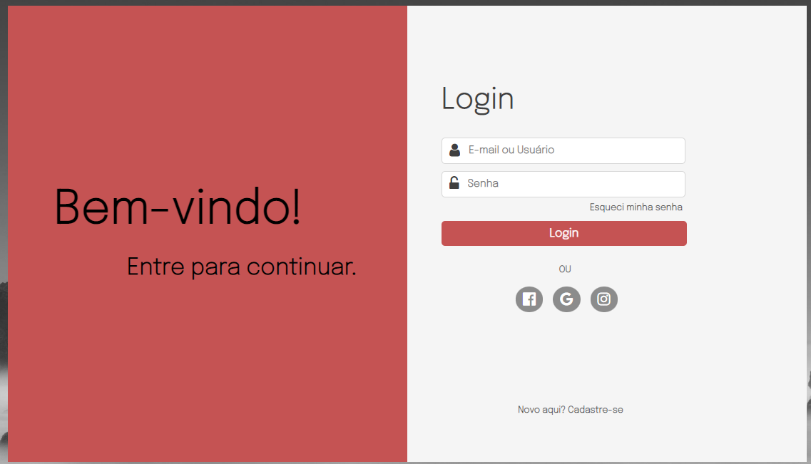

<h1 align="center">Página de login</h1>

 

<h1>Projeto de tela de login.</h1>

Em construção... 🚀

 

<h2> Tecnologias utilizadas </h2>
<ul>
    <li> HTML ✅</li>
    <li> CSS ✅</li>
    <li> JavaScript ✅</li>
</ul>

 
<h2> Imagem do projeto </h2>
